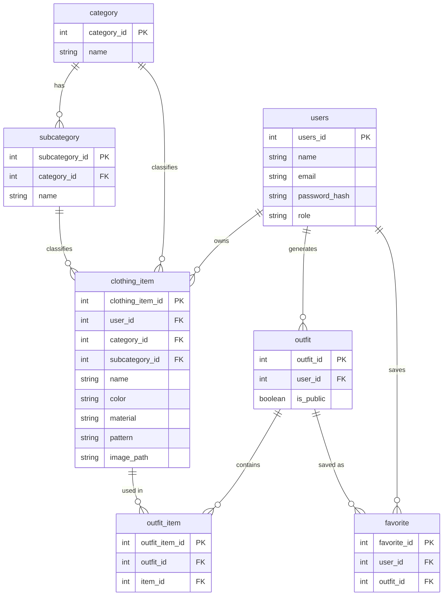
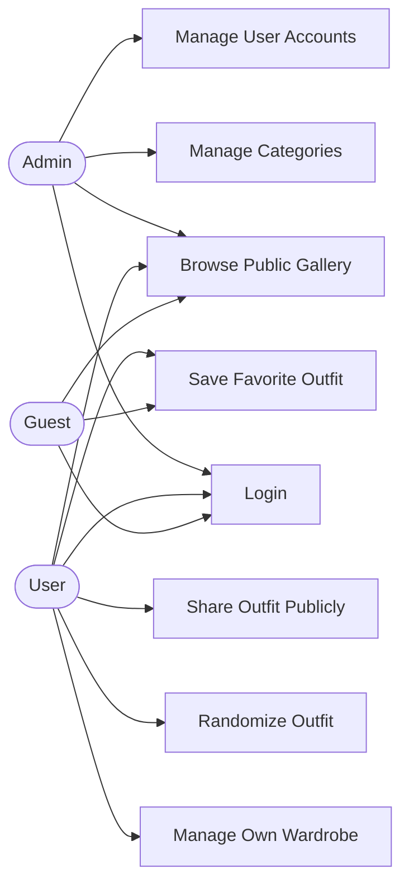

# Project Proposal: PHP + MySQL Application

> **Course:** J620-002-4:2020 Front-End Software Development (Level 4)
> **Competency Unit:** J620-002-4:2020-C01

---

## 1. Student Details

| Field          | Your Answer  |
| -------------- | ------------ |
| Candidate Name | Enya Teh     |
| NRIC Number    | 080802020808 |
| Date Submitted | 22/09/2026   |

---

## 2. Project Title

**WearIt – Smart Wardrobe & Random Outfit Generator**

### One-line summary

A web application that lets users catalogue their own clothes and, with one click, get a randomly generated outfit suggestion, and share favorite outfits with the community.

---

## 3. Problem Statement & Purpose

Many people own plenty of clothes but still struggle every morning to decide what to wear, often defaulting to the same few outfits ("I have nothing to wear" syndrome). WearIt solves this by letting users digitize their wardrobe (photos, category, color, season/occasion tags) and generate a random, ready-to-wear outfit combination at the click of a button. It is aimed at everyday users who want faster morning routines and more variety from clothes they already own. Users can also choose to make a generated outfit public, so the community can browse and get inspiration from each other's random outfits. A lightweight admin manages system-wide reference data (clothing categories, user accounts).

---

## 4. Tech Stack

| Layer       | Technology |
| ----------- | ---------- |
| Markup      | HTML5      |
| Styling     | CSS3       |
| Server-side | PHP        |
| Database    | MySQL      |

---

## 5. Types of Users (Roles)

| Role  | Description                                                                                                                                                               |
| ----- | ------------------------------------------------------------------------------------------------------------------------------------------------------------------------- |
| Admin | Manages system-level data: clothing categories and user accounts. Does not own a personal wardrobe.                                                                       |
| User  | The everyday wardrobe owner. Adds/edits/deletes their own clothing items, uses the "Randomize Outfit" button, saves favorite outfits, and can share an outfit publicly.   |
| Guest | A logged-in account with limited access — can browse outfits that Users have shared publicly and save them to favorites, but cannot build a wardrobe or generate outfits. |

### Role-Based Access Matrix

| Feature / Page                         | Admin | User | Guest |
| -------------------------------------- | :---: | :--: | :---: |
| Register / Login                       |  ✅   |  ✅  |  ✅   |
| Manage Categories & Subcategories      |  ✅   |  ❌  |  ❌   |
| Manage User Accounts                   |  ✅   |  ❌  |  ❌   |
| Add/Edit/Delete Own Clothing Items     |  ❌   |  ✅  |  ❌   |
| Random Outfit Generator (own wardrobe) |  ❌   |  ✅  |  ❌   |
| Share Outfit Publicly                  |  ❌   |  ✅  |  ❌   |
| Browse Publicly Shared Outfits         |  ✅   |  ✅  |  ✅   |
| Save/Favorite an Outfit                |  ❌   |  ✅  |  ✅   |

---

## 6. Features

### 6.1 Core Features (must have)

- [ ] User registration and login
- [ ] Role-based access control (Admin / User / Guest each see different pages)
- [ ] Data management (Create, Read, Update, Delete on clothing items, outfits, categories, users)
- [ ] Random outfit generator (User picks a button → system randomly picks one item per category from that User's own wardrobe)
- [ ] Public outfit gallery with favorites

### 6.2 Extra Features (nice to have)

- [ ] Filter randomizer by occasion/season/color before generating
- [ ] Outfit history per Member

### 6.3 Feature Descriptions

| Feature                    | Description                                                                                                                          | Role(s)            |
| -------------------------- | ------------------------------------------------------------------------------------------------------------------------------------ | ------------------ |
| Wardrobe management        | Add a clothing item with image URL, category, subcategory, color, material, pattern, season/occasion tag; edit or delete it          | User               |
| Random outfit generator    | One-click button that randomly selects one item from each required category from the User's own items and displays it as an "outfit" | User               |
| Share outfit publicly      | User can mark a generated outfit as public so it appears in the community gallery                                                    | User               |
| Public outfit gallery      | Browse outfits that Users have shared publicly                                                                                       | Admin, User, Guest |
| Favorites                  | Save a public outfit to a personal favorites list                                                                                    | User, Guest        |
| Category & user management | Add/edit/delete clothing categories and subcategories; create accounts and assign roles                                              | Admin              |

---

## 7. Data Management System

| Data / Entity              | Create      | Read               | Update      | Delete      |
| -------------------------- | ----------- | ------------------ | ----------- | ----------- |
| Users                      | Admin       | Admin              | Admin       | Admin       |
| Categories & Subcategories | Admin       | User, Guest, Admin | Admin       | Admin       |
| Clothing Items             | User        | User, Admin        | User, Admin | User, Admin |
| Outfits                    | User        | User, Admin        | User        | User, Admin |
| Favorites                  | User, Guest | User, Guest, Admin | —           | User, Guest |

---

## 8. Database Design

1. **users**
   -id (PK)
   -name
   -email
   -password_hash
   -role ENUM('admin','user','guest')
   -created_at
2. **category**
   -id (PK)
   -name
3. **subcategory**
   -id (PK)
   -category_id (FK)
   -name
4. **clothing_item**
   -id (PK)
   -user_id (FK)
   -category_id (FK)
   -subcategory_id (FK)
   -name
   -color
   -material
   -season
   -image_path
   -created_at
5. **outfit**
   -id (PK)
   -user_id (FK)
   -occasion
   -is_public
   -created_at
6. **outfit_item**
   -id (PK)
   -outfit_id (FK)
   -item_id (FK)
7. **favorite**
   -id (PK)
   -user_id (FK)
   -outfit_id (FK)
   -created_at

### Entity Relationship Diagram (ERD)

---

## 9. Use Case Diagram

---

## 10. Presentation Checklist

- [ ] Can explain the purpose of the application
- [ ] Can justify design choices (why this database structure, why these roles)
- [ ] Can demo every role
- [ ] Can answer questions about my own code
- [ ] Submitted on time
