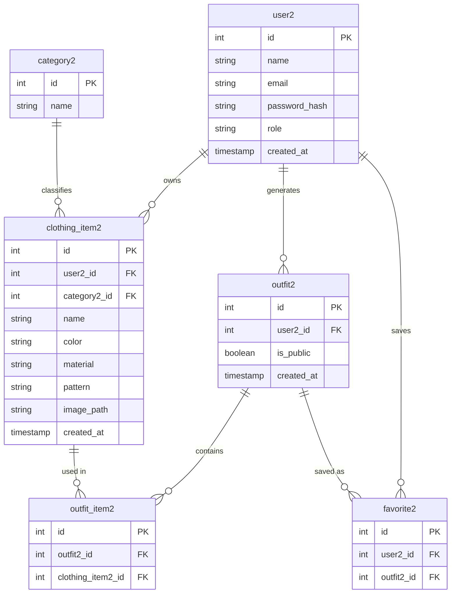
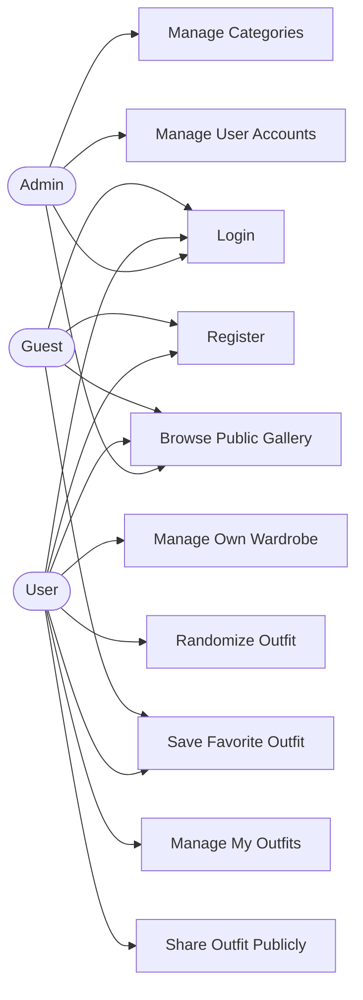

# Project Proposal: PHP + MySQL Application

> **Course:** J620-002-4:2020 Front-End Software Development (Level 4)
> **Competency Unit:** J620-002-4:2020-C01

---

## 1. Student Details

| Field          | Your Answer  |
| -------------- | ------------ |
| Candidate Name | Enya Teh     |
| NRIC Number    | 080802020808 |
| Date Submitted | 22/09/2026   |

---

## 2. Project Title

**WearIt – Smart Wardrobe & Random Outfit Generator**

### One-line summary

A web application that lets users catalogue their own clothes and, with one click, get a randomly generated outfit suggestion, and share favorite outfits with the community.

---

## 3. Problem Statement & Purpose

Many people own plenty of clothes but still struggle every morning to decide what to wear, often defaulting to the same few outfits ("I have nothing to wear" syndrome). WearIt solves this by letting users digitize their wardrobe (image, category, color, material and pattern) and generate a random, ready-to-wear outfit combination at the click of a button. It is aimed at everyday users who want faster morning routines and more variety from clothes they already own. Users can save generated outfits and choose to make them public, so the community can browse and get inspiration from each other's outfits. A lightweight admin manages system-wide reference data (clothing categories) and user accounts.

---

## 4. Tech Stack

| Layer       | Technology |
| ----------- | ---------- |
| Markup      | HTML5      |
| Styling     | CSS3       |
| Server-side | PHP        |
| Database    | MySQL      |

---

## 5. Types of Users (Roles)

| Role  | Description                                                                                                                                                               |
| ----- | ------------------------------------------------------------------------------------------------------------------------------------------------------------------------- |
| Admin | Manages system-level data: clothing categories and user accounts. Does not have a personal wardrobe.                                                                       |
| User  | The wardrobe owner. Manages their own clothing items, uses the "Randomize my outfit" button, saves outfits, shares them publicly, and favorites other people's public outfits.  |
| Guest | A logged-in account with limited access — can browse outfits that Users have shared publicly and save them to favorites, but cannot build a wardrobe or generate outfits. |

### Role-Based Access Matrix

| Feature / Page                         | Admin | User | Guest |
| -------------------------------------- | :---: | :--: | :---: |
| Register / Login                       |  ✅   |  ✅  |  ✅   |
| Manage Categorie                       |  ✅   |  ❌  |  ❌   |
| Manage User Accounts                   |  ✅   |  ❌  |  ❌   |
| Add/Edit/Delete Own Clothing Items     |  ❌   |  ✅  |  ❌   |
| Random Outfit Generator (own wardrobe) |  ❌   |  ✅  |  ❌   |
| Share Outfit Publicly                  |  ❌   |  ✅  |  ❌   |
| Browse Publicly Shared Outfits         |  ✅   |  ✅  |  ✅   |
| Save/Favorite an Outfit                |  ❌   |  ✅  |  ✅   |

---

## 6. Features

### 6.1 Core Features (must have)

- [ 1 ] User registration and login
- [ 1 ] Role-based access control (Admin / User / Guest each see different pages)
- [ 1 ] Data management (Create, Read, Update, Delete on clothing items, outfits, categories, users)
- [ 1 ] Random outfit generator (User clicks a button → system randomly picks one item per category from that User's own wardrobe)
- [ 1 ] Public outfit gallery with favorites

### 6.2 Extra Features (nice to have)

- [ 1 ] Admin cannot delete their own account
- [ 1 ] Image preview for the image URL when adding an item
- [ 1 ] Outfit history per Member
- [ 0 ] Filter randomizer by color before generating

### 6.3 Feature Descriptions

| Feature                    | Description                                                                                                                          | Role(s)            |
| -------------------------- | ------------------------------------------------------------------------------------------------------------------------------------ | ------------------ |
| Registration & login       | Register as a User or Guest with name, email and password (password is stored as a hash). Login redirects each role to its own start page.                                                                                         | Admin, User, Guest |
| Wardrobe management        | Add a clothing item with image, category, color, material and pattern; edit or delete it.                                                       | User               |
| Random outfit generator    | One-click button that randomly selects one item from each category (Top, Bottom and Shoes are required; Outerwear is optional) from the User's own items and displays it as an "outfit". The User can then save the outfit.        | User               |
| My Outfits                 | View all saved outfits, make an outfit public or private, or delete it.                                                                                                                                                            | User               |
| Public outfit gallery      | Browse outfits that Users have shared publicly, together with the name of the owner.                                                                                                                                               | Admin, User, Guest |
| Favorites                  | Favorite or un-favorite a public outfit from the gallery, and view or remove favorites on the Favourites page.                                                                                                                     | User, Guest        |
| Category management        | Add or delete clothing categories. A category that is still used by clothing items cannot be deleted, and a message is shown.                                                                                  | Admin              |
| User account management    | View all users, change a user's role (admin / user / guest) or delete a user. An admin cannot delete their own account.                                                                                                            | Admin              |

---

## 7. Data Management System

| Data / Entity              | Create      | Read                 | Update      | Delete      |
| -------------------------- | ----------- | -------------------- | ----------- | ----------- |
| Users                      | User, Guest | Admin                | Admin       | Admin       |
| Categories                 | Admin       | User,  Admin         | Admin       | Admin       |
| Clothing Items             | User        | User                 | User        | User        |
| Outfits                    | User        | User / Guest / Admin | User        | User        |
| Favorites                  | User, Guest | User, Guest          | —           | User, Guest |

---

## 8. Database Design

1. **user2**
   -id (PK)
   -name
   -email
   -password_hash
   -role ENUM('admin','user','guest')
   -created_at
2. **category2**
   -id (PK)
   -name
3. **clothing_item2**
   -id (PK)
   -user2_id (FK)
   -category2_id (FK)
   -name
   -color
   -material
   -pattern
   -image_path
   -created_at
4. **outfit2**
   -id (PK)
   -user2_id (FK)
   -is_public
   -created_at
5. **outfit_item2**
   -id (PK)
   -outfit2_id (FK)
   -clothing_item2_id (FK)
6. **favorite2**
   -id (PK)
   -user2_id (FK)
   -outfit2_id (FK)

### Entity Relationship Diagram (ERD)

---

## 9. Use Case Diagram

---

## 10. Presentation Checklist

- [ ] Can explain the purpose of the application
- [ ] Can justify design choices (why this database structure, why these roles)
- [ ] Can demo every role
- [ ] Can answer questions about my own code
- [ ] Submitted on time
